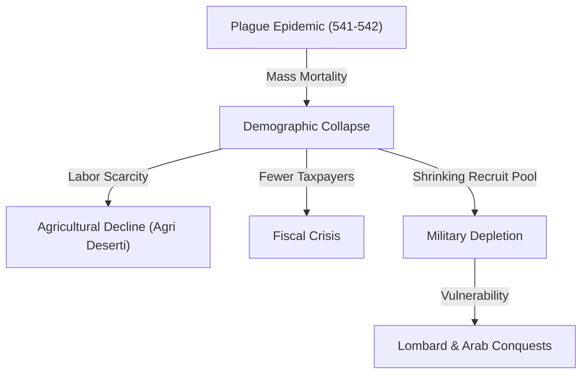

# The Justinianic Plague (541–542)

The **Justinianic Plague** was a devastating pandemic of bubonic plague caused by the bacterium *Yersinia pestis* that swept through the Byzantine Empire and the wider Mediterranean world between 541 and 542 CE, with recurring waves persisting until c. 750 CE. It is the first historically documented outbreak of bubonic plague (the First Plague Pandemic), resulting in an estimated 25% to 50% mortality rate across the region, triggering demographic collapse, labor shortages, and a fiscal-military crisis that permanently weakened the Byzantine state.

---

## Narrative

### Outbreak and Transmission (541)
According to the contemporary historian **Procopius**, the plague originated in Pelusium (Egypt) in 541 CE. It spread along commercial shipping routes to Alexandria, Palestine, and Syria. The disease was carried by black rats (*Rattus rattus*) infesting grain transports, with fleas (*Xenopsylla cheopis*) serving as the primary vector for transmission to humans.

### The Peak in Constantinople (542)
In the spring of 542 CE, the plague reached the Byzantine capital, Constantinople. At its height, the disease reportedly killed between 5,000 and 10,000 people per day. The city's administrative apparatus broke down; public spaces were converted into mass graves, and corpses were packed into the towers of the city's northern walls or dumped into boats and pushed out to sea. 

Justinian himself contracted the disease but survived. The Empress Theodora administered the empire during his illness. By the time the first wave receded in late 542, Constantinople had lost up to half of its population.

### Recurrent Waves (542–750)
The pandemic did not vanish but returned in regional waves every 10 to 15 years. Significant recurrences occurred in 558, 573, 599, and into the mid-eighth century. The cumulative demographic drain prevented population recovery and led to long-term economic contraction across Europe and the Near East.

---

## Causal Analysis

*   **Pathogenic Vector (`caused_by`):** The plague was caused by *Yersinia pestis*, a flea-borne bacterium. It occurred at the end of the **Roman Climate Optimum** and the start of the **Late Antique Little Ice Age (LALIA)** (536 CE onward) (Harper 2017, line 386). A cluster of massive volcanic explosions (in 536 and 540–541 CE) caused solar dimming and severe cold seasons, which disrupted rodent habitats in Central Asia or East Africa, driving them into contact with human trade routes (Harper 2017, line 2431).
*   **Commercial Integration (`enabled`):** The high integration of the Byzantine Mediterranean trading network—particularly the massive state-controlled grain shipments from Egypt to Constantinople—provided a rapid transit system for infected rats and fleas (Harper 2017, line 2252). The Roman-built built environment was an ideal habitat for black rats (*Rattus rattus*), facilitating their migration and rural penetration across Europe (Harper 2017, lines 2264, 2388).

---

## Consequence Analysis

The plague severely altered the trajectory of the late antique world:
*   **Demographic Collapse:** The loss of up to half the urban population and a significant percentage of rural labor shattered the Roman tax-base.
*   **Fiscal and Economic Crisis:** The scarcity of labor drove up wages while reducing agricultural output. Land was abandoned on a massive scale, leading to a rise in *agri deserti* (uncultivated fields). The fiscal crisis of the plague era forced Justinian to withhold and cut military salaries, making him the first Roman emperor to fail to pay his troops (Harper 2017, line 3159).
*   **Military Overstretch:** The pool of recruits for the Roman army contracted dramatically, with the total force size collapsing from 645,000 to just 150,000 men (Harper 2017, line 3153). This directly crippled Justinian’s ability to defend his newly reconquered western territories (Italy, Africa, Spania) and maintain the Danube frontier, paving the way for the **[[lombards|Lombard invasion of Italy (568)]]** and the **[[successors-of-justinian|Slav and Avar incursions]]** in the Balkans.

---

## Related Pages

*   **Actors**: [[justinian]] · [[successors-of-justinian]] · [[lombards]]
*   **Controversies**: [[causes-of-the-fall-of-the-western-roman-empire]] · [[controversies/fall-of-rome-causes]]
*   **Sources**: [[fouracre-ncmh-v1-2005]] · [[cameron-cah-v14-2000]] · [[sources/harper-fate-of-rome-2017]]; the great eyewitness account of
    **[[john-of-ephesus|John of Ephesus]]** is now ingested in
    **[[pseudo-dionysius-zuqnin-chronicle|Pseudo-Dionysius of Tel-Mahre, Chronicle Part III]]** — a key
    independent witness alongside Procopius.
