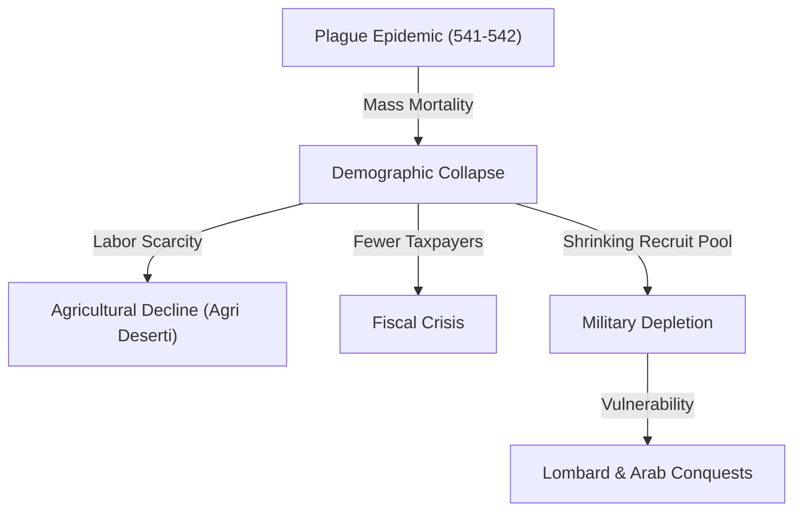

# The Justinianic Plague (541–542)

The **Justinianic Plague** was a devastating pandemic of bubonic plague caused by the bacterium *Yersinia pestis* that swept through the Byzantine Empire and the wider Mediterranean world between 541 and 542 CE, with recurring waves persisting until c. 750 CE. It is the first historically documented outbreak of bubonic plague (the First Plague Pandemic), resulting in an estimated 25% to 50% mortality rate across the region, triggering demographic collapse, labor shortages, and a fiscal-military crisis that permanently weakened the Byzantine state.

---

## Narrative

### Outbreak and Transmission (541)
According to the contemporary historian **Procopius**, the plague originated in Pelusium (Egypt) in 541 CE. It spread along commercial shipping routes to Alexandria, Palestine, and Syria. The disease was carried by black rats (*Rattus rattus*) infesting grain transports, with fleas (*Xenopsylla cheopis*) serving as the primary vector for transmission to humans.

### The Peak in Constantinople (542)
In the spring of 542 CE, the plague reached the Byzantine capital, Constantinople. At its height, the disease reportedly killed between 5,000 and 10,000 people per day. The city's administrative apparatus broke down; public spaces were converted into mass graves, and corpses were packed into the towers of the city's northern walls or dumped into boats and pushed out to sea. 

Justinian himself contracted the disease but survived. The Empress Theodora administered the empire during his illness. By the time the first wave receded in late 542, Constantinople had lost up to half of its population.

### Recurrent Waves (542–750)
The pandemic did not vanish but returned in regional waves every 10 to 15 years. Significant recurrences occurred in 558, 573, 599, and into the mid-eighth century. The cumulative demographic drain prevented population recovery and led to long-term economic contraction across Europe and the Near East.

---

## Causal Analysis

*   **Pathogenic Vector (`caused_by`):** The plague was caused by *Yersinia pestis*, a flea-borne bacterium. It occurred at the end of the **Roman Climate Optimum** and the start of the **Late Antique Little Ice Age (LALIA)** (536 CE onward) (Harper 2017, line 386). A cluster of massive volcanic explosions (in 536 and 540–541 CE) caused solar dimming and severe cold seasons, which disrupted rodent habitats in Central Asia or East Africa, driving them into contact with human trade routes (Harper 2017, line 2431).
*   **Commercial Integration (`enabled`):** The high integration of the Byzantine Mediterranean trading network—particularly the massive state-controlled grain shipments from Egypt to Constantinople—provided a rapid transit system for infected rats and fleas (Harper 2017, line 2252). The Roman-built built environment was an ideal habitat for black rats (*Rattus rattus*), facilitating their migration and rural penetration across Europe (Harper 2017, lines 2264, 2388).

---

## Consequence Analysis

The plague severely altered the trajectory of the late antique world:
*   **Demographic Collapse:** The loss of up to half the urban population and a significant percentage of rural labor shattered the Roman tax-base.
*   **Fiscal and Economic Crisis:** The scarcity of labor drove up wages while reducing agricultural output. Land was abandoned on a massive scale, leading to a rise in *agri deserti* (uncultivated fields). The fiscal crisis of the plague era forced Justinian to withhold and cut military salaries, making him the first Roman emperor to fail to pay his troops (Harper 2017, line 3159).
*   **Military Overstretch:** The pool of recruits for the Roman army contracted dramatically, with the total force size collapsing from 645,000 to just 150,000 men (Harper 2017, line 3153). This directly crippled Justinian’s ability to defend his newly reconquered western territories (Italy, Africa, Spania) and maintain the Danube frontier, paving the way for the **[[lombards|Lombard invasion of Italy (568)]]** and the **[[successors-of-justinian|Slav and Avar incursions]]** in the Balkans.

---

## Sarris and the Social Consequences of the Plague

**Peter Sarris** ([[sarris-empires-of-faith-2011|*Empires of Faith*]], 2011), a leading
**maximalist**, reads the plague as a structural hinge that worked on *two* fronts at
once. For the state it was a fiscal disaster — a sudden loss of taxpayers that forced
retrenchment of civil-service pensions and military pay, and the issue of light-weight
*solidi* while collectors were required to receive full-weight coin. But for the
**survivors among the labouring poor it opened opportunities**: Justinian's edict of 545
complains that artisans and agricultural workers were demanding "twice or even three
times" their customary wages; the *Life of St Nicholas of Sion* shows Lycian farmers
defying city councillors; and Egyptian land-leases of the mid-sixth century record a
marked improvement in tenants' security of tenure. Sarris points to the **gold:copper
exchange ratio** as a quantitative trace — the number of copper *folles* per gold
*solidus* falling from c. 210 (538–42) to c. 180 (542–50), a shift that benefited those
paid in copper at the expense of their nominal superiors. The plague thus "shook the
economic foundations of aristocratic control while curtailing still more sharply the
fiscal resources upon which the state depended" — the same demographic shock cutting
against *both* poles of late-Roman society. Whether the pandemic really bore this weight
is itself contested: see **[[justinianic-plague-scale|the controversy on plague scale]]**
(maximalist Sarris/Harper vs. the minimalist case of Mordechai & Eisenberg).

---

## Historiography

The plague's **scale and significance are actively contested**. The traditional and still
dominant **maximalist** reading — that 25–50% mortality made the pandemic a structural
hinge of late antiquity — rests on a chorus of contemporary eyewitnesses (Procopius, John
of Ephesus, Evagrius, Gregory of Tours) and is developed in its fullest forms by **Kyle
Harper** (climate + disease) and **Peter Sarris** (the social and fiscal consequences).
Since 2019 a **minimalist** revision (Lee Mordechai, Merle Eisenberg) has argued from
"big-data" proxies — coins, papyri, inscriptions, pollen, mortuary archaeology — that the
demographic and economic rupture is largely invisible and has been retrojected from the
Black Death. **Palaeogenetics** has confirmed *Yersinia pestis* across a wide geographic
range, settling the pathogen but not the magnitude. The debate is filed as
**[[justinianic-plague-scale|The Scale and Significance of the Justinianic Plague]]**. A
key independent witness to the older source base, **[[john-of-ephesus|John of Ephesus]]**,
survives via [[pseudo-dionysius-zuqnin-chronicle|Pseudo-Dionysius of Tel-Maḥrē]].

---

## Gibbon, *Decline and Fall* (1776–1788) — Ch. XLIII

[[sources/gibbon-decline-and-fall-1776|Gibbon]] is an early modern *maximalist* witness in the [[justinianic-plague-scale|scale controversy]]: he inherits Procopius’s catastrophe language and universalizes unrepaired depopulation. Treat as **historiography**, not modern demography.

- **Origin and clinical picture:** “The fatal disease which depopulated the earth in the time of Justinian and his successors, first appeared in the neighborhood of Pelusium” (African putrefaction, esp. locusts); spread East to the Indies and West over Europe; Procopian buboes (groin, armpits, ear), black carbuncles, fifth-day death; Justinian himself touched but recovered.
- **Constantinopolitan scale:** No full global count; “during three months, five, and at length ten, thousand persons died each day at Constantinople”; many Eastern cities vacant; Italian harvests withered; plague for 52 years; triple scourge of war, pestilence, famine; visible decrease of the human species never repaired in some fair countries.
- **Transmission:** Europe’s later sanitary precautions unknown; “No restraints were imposed on the free and frequent intercourse of the Roman provinces: from Persia to France, the nations were mingled and infected”; spread from sea-coast inland; contagion real though Constantinopolitans denied it.

Source: [[sources/gibbon-decline-and-fall-1776]] · [[actors/gibbon-edward]]

## Related Pages

*   **Actors**: [[justinian]] · [[successors-of-justinian]] · [[lombards]]
*   **Controversies**: [[fall-of-rome-causes]] · [[justinianic-plague-scale]]
*   **Sources**: [[fouracre-ncmh-v1-2005]] · [[cameron-cah-v14-2000]] · [[harper-fate-of-rome-2017]] · [[sarris-empires-of-faith-2011]] · [[sources/gibbon-decline-and-fall-1776]] · [[mitchell-later-roman-empire-2015]]; the great eyewitness account of
    **[[john-of-ephesus|John of Ephesus]]** is now ingested in
    **[[pseudo-dionysius-zuqnin-chronicle|Pseudo-Dionysius of Tel-Mahre, Chronicle Part III]]** — a key
    independent witness alongside Procopius.

## From Mitchell, Later Roman Empire (2015)

Stephen Mitchell’s synthesis (*A History of the Later Roman Empire*, 2nd ed.) places the **541/2 bubonic outbreak** at the centre of mid-sixth-century pessimism and, more contentiously, of eastern “decline and fall” explanations (pp. 479–91). Claims below are attributed to Mitchell and the sources he marshals; they do not adjudicate the [[justinianic-plague-scale|scale debate]].

### Outbreak, mortality, clinical forms

- **Capital wave.** First Constantinople outbreak raged four months in the first half of **542** (Procopius *Bell. Pers.* 2.22–23; John of Ephesus via Ps-Dionysius). Infection arrived from Egyptian **Pelusium**; Evagrius may correctly place origin further south in Ethiopia. Daily deaths rose from 5,000 to 10,000; John of Ephesus gives a maximum of **16,000/day** and notes the official count stopped at **230,000** overall. Zuckerman’s study (as cited by Mitchell) suggests ~one-third of a city population ~750,000; the *Secret History* alleged half the empire’s inhabitants died after prior disasters.
- **Forms and transmission.** Three clinical forms: buboes; septicemia; pulmonary. Fleas transmit the first two (rats↔humans); pulmonary spreads person-to-person via spittle; septicemic death could occur within hours. First outbreak into **543** was empire-wide (Procopius, Evagrius).
- **Recurrence.** Evagrius noted recurrences roughly on the **fifteen-year indiction cycle**. Dionysios Stathakopoulos identifies **eighteen major recurrences 541–750**; four of the first five (541–3; 571–4; 590–2; 597–601) are attested east and west. Constantinople struck again 618/9, 658, 747; plague also in England/Ireland in the seventh century; archaeology points to Bavaria (perhaps Poland, Finland).

### Climate crisis preceding the plague

A major climatic episode in **536–7** darkened the sun (Procopius: tenth year of Justinian; Ps-Zachariah: 24 Mar 535–24 Jun 536; John of Ephesus: eighteen months of darkness). Cassiodorus describes dust-reduced visibility, feeble heat, failed crops; Lakhmid–Ghassanid grazing conflict intensified after crop failures in 536 (Marcellinus). Harvests of 536–7 were effectively destroyed; Cassiodorus’ *Variae* show Italian tax-in-kind crisis and famine relief. In the [[gothic-war-535-554|Gothic War]], Procopius records **>50,000 peasants starving in Picenum alone (539)**. Likeliest cause: volcanic dust-cloud (Keys); dendrochronology shows spectacular European lows 536, 539, 540 and global growth depression. `concurrent_with:` Gothic War; `contributed_to:` prior stress on populations and fiscal systems (not asserted as sole cause of plague).

### Fiscal and administrative shock

Whatever the longer-term demography, contemporary sources suggest up to a **third of the population may have perished 542–545**; tax collection and other administrative procedures virtually stood still. Fiscal gains of Justinian’s first reign phase were **reversed**; treasury decline can be followed for the rest of the sixth century (following Sarris). `contributed_to:` stress on the [[roman-imperial-taxation-and-fiscal-system|fiscal system]] and [[byzantine-economy|eastern economy]].

### Historiography: maximizers vs minimizers (Mitchell’s frame)

Overall Mediterranean impact is disputed:

| Position | Argument (as Mitchell presents) |
|---|---|
| **Whittow** | No evidence of devastating impact consistent with a still-powerful state c.600 |
| **Wickham** | Sixth-century plague “a marginal event in the demographic history of our period” despite dramatic local incidences; systematically excludes mass plague mortality from socio-economic explanations |
| **Liebeschuetz** | Plague major but not sole factor in sixth–seventh-century population decline |
| **Sarris** | Altered grassroots social balance, shook aristocratic economic foundations, curtailed state resources |
| **Little (ed.) *Plague and the End of Antiquity*** | Gives plague a central explanatory place |

Mitchell notes possible exaggeration of long-term effects by focus on 541–3, and Black Death parallel (recovery within a century), yet his **provisional assessment is pessimistic**: most commentators argue **20–50% population fall between 542 and Heraclius’ death**; Wickham’s own rural survey still implies ~50% decline 550–700.

**Method.** Direct archaeological plague proof remains sparse (hasty mass burial; possible re-use of single graves; rare aDNA); therefore proxy indicators: occupation/abandonment, settlement form, location/material clues — under representative regional coverage and reliable fine-pottery dating. Open questions include post-550 domestic building, continued occupation vs abandonment, whether church building = vitality or “piety of desperation.”

### Regional theses

- **Italy — plague over war.** Italian urban impoverishment after c.550 coincided with Gothic War devastation, but forces were too small and campaigns too localized for war alone to cause pervasive lasting urban collapse: “High mortality caused by the plague, with catastrophic disruption of all the forms of urban administration, seems a more likely catalyst than warfare.” Paul the Deacon emphasizes desertion of settlements and further outbreaks 590, 593, 680 at Ticinum with grass in the marketplace. `maps_to:` [[post-roman-transformation-of-the-west]].
- **Gaul / Spain.** Marseille remained a commercial hub under Merovingian investment yet Gregory of Tours (*Hist.* 9.22) records plague introduced by a Spanish ship in **588** with flaring to 594 — port role made it extremely plague-vulnerable. Broader Gaul: most cities very small (Liebeschuetz: some <1,000); Spain thinly populated so Kulikowski suggests plague hosted less extendedly and mortality may have been proportionately lower.
- **Near East debate.** Liebeschuetz: settlement continuity 500–800 but major post-550 drop in city population/economic activity. Wickham: flourishing southern Levant rural/urban communities through late 6th–7th c. as Damascus Caliphate replaced Rome. Mitchell’s re-reading (Déhès limestone massif; Hauran/Umm el-Jimal; Negev/Shivta; Antioch/Apamea cumulative disasters 526–594) argues **northern Syria sharp reduction well before Muslim conquests**; southern cities transformed not catastrophically erased (Scythopolis street width 12→3 m; Gerasa hippodrome mass burials; Pella grave re-use).
- **Mitchell plague-maximizer thesis.** Cumulatively, archaeological pattern yields “a very strong case” for bubonic plague of 542 and recurrence to mid-8th c. as **major cause of demographic decline**, with catastrophic impact on population levels, economic productivity, and administrative capacity. Late 6th–7th c. intensive church/monastery building is compatible with Black Death-type wealth concentration and institutional acquisition of abandoned land — not proof of undiminished vitality.
- **Southern Levant/Egypt resilience despite equal exposure.** (1) **Size matters** — huge late antique cities/villages could lose half or more and remain viable; surviving urban labor could prosper (higher wages) where structures intact. (2) **Political** — earliest Arab provinces; caliphs kept cities/villages as tax sources, brought settlers, revitalized selected centres; Negev reoriented toward Hejaz. Analogues: Rome/Constantinople, Metz/Marseille under Frankish kings — state power can shore up selected centres amid general decline.

Source: [[mitchell-later-roman-empire-2015]] · cross-links: [[justinianic-plague-scale]] · [[late-antiquity-decline-vs-transformation]] · [[fall-of-rome-causes]] · [[gothic-war-535-554]] · [[roman-imperial-taxation-and-fiscal-system]]
