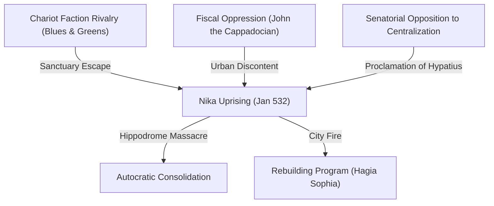

# The Nika Riots (532)

The **Nika Riots** (January 532 CE) were a violent popular uprising in Constantinople that nearly toppled the emperor [[justinian|Justinian I]]. The riots represent the most destructive civil disturbance in the history of the eastern Roman (Byzantine) capital, resulting in the burning of the city center, the slaughter of approximately 30,000 citizens in the Hippodrome, and the subsequent consolidation of Justinian's autocratic power.

---

## Narrative

### The Spark (January 13, 532)
Constantinople's chariot-racing factions, the **Blues** and the **Greens**, functioned as political clubs, youth militias, and civic organizations. Tension had been rising due to the administrative reforms of Justinian's chief officials, [[john-the-cappadocian|John the Cappadocian]] (the prefect) and [[tribonian|Tribonian]] (the quaestor), whose ruthless fiscal extractions alienated both the aristocracy and the urban poor. 

Following a clash in the Hippodrome, members of both factions were sentenced to death by the city prefect. Two men, one Blue and one Green, escaped when the gallows collapsed and took sanctuary in a church. On January 13, at the next chariot races, both factions appealed to Justinian to pardon the men. When the emperor refused, the factions united under the battle cry ***"Nika!"*** ("Conquer!" or "Win!"), broke out of the Hippodrome, and besieged the palace.

### The Conflagration (January 14–17)
The rioters set fire to public buildings. The city's administrative center, the Senate House, the Baths of Zeuxippus, the Chalke Gate, and the cathedral of Hagia Sophia were destroyed. The rioters demanded the dismissal of John the Cappadocian, Tribonian, and the city prefect. Justinian complied, but the concession failed to pacify the mob.

Senatorial elites, hostile to Justinian's centralizing policies and low social origins, saw the riots as an opportunity to depose him. On January 17, they proclaimed **Hypatius**, a nephew of the former emperor Anastasius, as rival emperor at the Forum of Constantine.

### The Resolution (January 18)
Justinian prepared to flee the capital by sea, but was dissuaded by his wife, the Augusta **[[theodora|Theodora]]**, who famously declared that "the imperial purple is a fine winding-sheet." Stiffened by her resolve, the emperor ordered generals [[belisarius|Belisarius]] and **Mundus** to suppress the rebellion.

Narses, the imperial treasurer, entered the Hippodrome and bribed the leaders of the Blues, reminding them that Hypatius was a Green sympathizer and that Justinian favored the Blues. The Blues began to leave the arena. Immediately, Belisarius and Mundus blocked the gates of the Hippodrome with their elite Gothic and Herul mercenaries, trapping the remaining crowd. They slaughtered approximately 30,000 people inside the arena. Hypatius and his brother Pompeius were arrested and executed, and their properties were confiscated.

---

## Causal Analysis

The Nika Riots were driven by three distinct layers of causation:
*   **Immediate Trigger (`caused_by`):** The arrest and botched execution of Blue and Green faction members, prompting a rare alliance between the two traditionally rival factions.
*   **Structural Discontent (`contributed_to`):** The heavy taxation and legal reforms led by John the Cappadocian and Tribonian, which squeezed the wealth of both the aristocracy and the lower classes.
*   **Political Opportunity (`contributed_to`):** Senatorial hostility toward Justinian's low Illyrian origins and autocratic ambitions. The Senate actively weaponized the urban mob to attempt a dynastic restoration.

---

## Consequence Analysis

The suppression of the riots had profound structural outcomes:
*   **Militarized Autocracy:** The destruction of the senatorial leadership enabled Justinian to rule without serious domestic opposition, establishing the emperor as the absolute lawgiver.
*   **Rebuilding of Constantinople:** The fire cleared the city center, allowing Justinian to embark on a monumental building program. The crown jewel of this effort was the rebuilding of **[[hagia-sophia|Hagia Sophia]]**, constructed on a scale designed to demonstrate divine sanction of his rule.
*   **Fiscal Freedom:** With the aristocracy cowed, Justinian was able to pursue John the Cappadocian's taxation policies, raising the funds necessary for his western reconquests.

---

## Historiography

Nika is known chiefly through Procopius and later chroniclers; casualty figures (including Gibbon’s “above thirty thousand”) are literary maximal estimates, not censuses. Modern accounts treat the riot as both circus-faction violence and a senatorial/political crisis that Justinian used to consolidate autocracy. Theodora’s “purple winding-sheet” speech is a Procopian set-piece whose historicity is debated but whose narrative function is fixed.

### Gibbon, *Decline and Fall* (1776–1788) — Ch. XL

[[sources/gibbon-decline-and-fall-1776|Gibbon]]’s Nika is the preconditioned circus crisis of Justinian’s early reign, resolved by massacre and Theodora’s resolve.

- **Blue favoritism as precondition:** Blues zealously devoted to orthodoxy and Justinian; he protected their disorders above five years; Theodora never forgave Green injuries to the comedian; “license without freedom” of democracy revived.
- **Course:** Mutual hatred then reconciliation of factions; five days of fire (St. Sophia, Zeuxippus, palace areas); watchword *Nika*; Justinian nearly fled; Theodora’s speech restored resolve; [[belisarius|Belisarius]] and Mundus massacred the hippodrome; Hypatius and Pompey executed.
- **Scale:** “it is computed, that above thirty thousand persons were slain in the merciless and promiscuous carnage of the day.”

Source: [[sources/gibbon-decline-and-fall-1776]] · [[actors/gibbon-edward]]

## Related Pages

*   **Actors**: [[justinian]] · [[belisarius]] · [[successors-of-justinian]]
*   **Places**: [[rome]] (contrasted with Constantinople)
*   **Sources**: [[fouracre-ncmh-v1-2005]] · [[cameron-cah-v14-2000]] · [[sources/gibbon-decline-and-fall-1776]] · [[mitchell-later-roman-empire-2015]]

## From Mitchell, Later Roman Empire (2015)

Week-long Nika riot (from races **10 Jan 532**) united Blue/Green chant “Nika”; prefecture burned; Justinian dismissed John the Cappadocian, Tribonian, and city prefect; Belisarius’ troops killed many; Hagia Sophia burned; Hypatius and Pompeius (Anastasius’ grandsons) acclaimed; Narses split mob with cash while Belisarius and Mundus slaughtered **30–35,000**; ringleaders arrested, Hypatius/Pompeius executed, elites exiled. “The most discussed as well as the most mysterious event of Justinian’s reign.”

Mitchell **rejects** regime-change-first readings and stories of Justinian nearly fleeing (Theodora’s speech): Anastasius’ relatives were “straw men”; real targets were the masses; guiding motive was curbing faction violence with troops as instruments of terror; either responsive or deliberately exacerbated crisis — but explanations requiring vacillation are “wholly incredible” given early Justinian’s decisiveness; aftermath publicized as victory removing “tyrants.”

Source: [[mitchell-later-roman-empire-2015]] · [[justinian]] · [[belisarius]]
