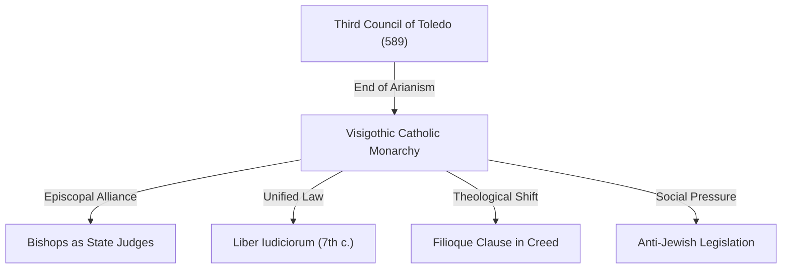

# The Third Council of Toledo (589)

The **Third Council of Toledo** was a major church synod that formalized the conversion of the Visigothic nobility and clergy from Arianism to Catholic Christianity. Presided over by King **[[reccared-i|Reccared I]]**, the council marked the end of the religious division between the Gothic ruling class and the Hispano-Roman majority. It established a highly centralized alliance between the Visigothic monarchy and the Catholic episcopate, paving the way for unified territorial legislation in Spain.

---

## Narrative

### Background
Since their settlement in Gaul and Spain, the Visigoths had maintained **Arianism** as a badge of ethnic identity, distinct from their Catholic Roman subjects. Reccared's father, **[[leovigild|King Leovigild]]**, had attempted to unify Spain under Arianism by easing conversion criteria (such as dropping rebaptism), but this failed and provoked a Catholic rebellion led by his own son, Hermenegild. 

Following Leovigild's death in 586, Reccared succeeded to the throne. Recognizing that religious dualism prevented stable rule, Reccared secretly converted to Catholicism in 587.

### The Synod (May 589)
Reccared summoned all bishops of Spain and Gallia Narbonensis to Toledo. On May 8, 589, the king read a profession of faith, formally anathematizing Arianism and declaring his conversion, along with that of the Visigothic court. The Visigothic Arian bishops and nobles present followed his lead, along with representatives of the annexed **Sueves** of Gallaecia.

The council was organized and steered by **Leander of Seville**, a close friend of the monarchy who had spent years in Constantinople, and Abbot Eutropius. The council passed twenty-three canons regulating church discipline, including the requirement that the Nicene Creed be recited at all masses—introducing the ***filioque* clause** ("and the Son") to assert Christ's full divinity against Arian subordinate Christology.

---

## Causal Analysis

*   **Political Pragmatism (`caused_by`):** The failure of Leovigild's Arian unification and the devastation of Hermenegild's civil war proved that Spain could not be governed as an Arian state. Reccared converted to secure the loyalty of the Hispano-Roman majority (who formed over 90% of the population) and the support of the wealthy Catholic episcopate.
*   **Constantinopolitan Influence (`contributed_to`):** Leander of Seville's close contacts with the Byzantine Empire (where he met Gregory the Great) provided a model of imperial-episcopal collaboration.

---

## Consequence Analysis

The council fundamentally reshaped the Visigothic state:
*   **Theocratic Monarchy:** Visigothic kingship was sacralized through anointment. The church became a pillar of royal authority, and provincial synods served as legislative assemblies.
*   **Episcopal Administration:** Catholic bishops were integrated into the civil administration, granted authority to supervise royal judges (*iudices*) and inspect local taxation.
*   **Legislative Unification:** The removal of religious barriers enabled the Visigoths to draft a single territorial law code, ending the division between Gothic and Roman law and culminating in the **Liber Iudiciorum** (c. 654).
*   **Anti-Jewish Canons:** The council took a hostile stance toward Spain's Jewish population, banning Jews from holding public office, marrying Christian women, or owning Christian slaves, inaugurating a century of intensifying anti-Jewish legislation.

---

## Related Pages

*   **Actors**: [[reccared-i]] · [[leovigild]] · [[germanic-peoples]]
*   **Places**: [[rome]]
*   **Sources**: [[fouracre-ncmh-v1-2005]] · [[cameron-cah-v14-2000]]
